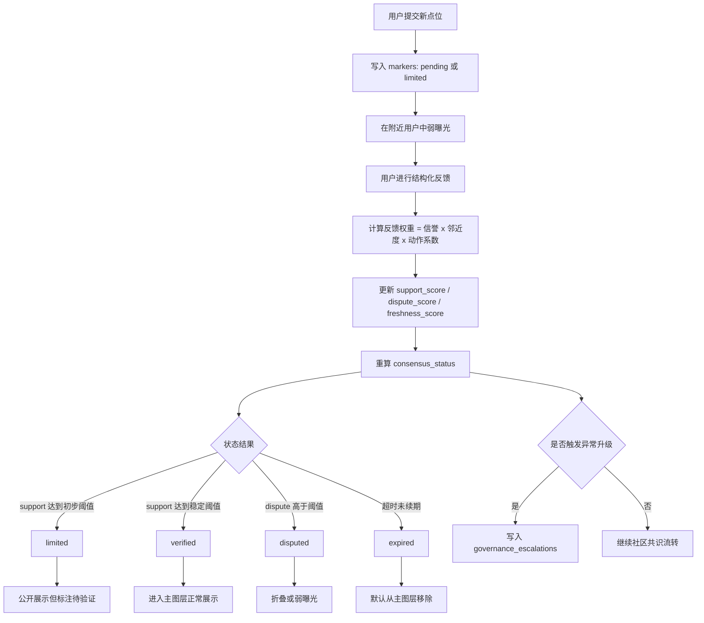

# Firefly 社区共识治理技术方案

版本：v1.0  
更新时间：2026-05-26

## 1. 目标

本方案用于替代中心化人工审核流程，将 Firefly 的内容治理迁移为：

- 社区反馈驱动
- 加权信誉驱动
- 时间衰减驱动
- 异常升级驱动

## 2. 状态机

## 2.1 状态枚举

- `pending`
- `limited`
- `verified`
- `disputed`
- `expired`

## 2.2 状态语义

### `pending`

- 新提交
- 未达到初步共识阈值
- 弱曝光或仅局部曝光

### `limited`

- 达到初步可信阈值
- 允许公开，但带待验证提示

### `verified`

- 达到稳定可信阈值
- 可正常进入主图层

### `disputed`

- 支持与反对分裂明显
- 被高可信用户集中打回

### `expired`

- 内容长时间无人确认
- 自动降级

## 2.3 状态流转规则

### 风险类

- `pending -> limited`：达到初步支持阈值
- `limited -> verified`：达到稳定支持阈值
- `limited/verified -> disputed`：反对分显著高于支持分
- `limited/verified -> expired`：超过有效期且无新确认

### 爱心类

- `limited -> verified`：获得多次有效合作反馈
- `verified -> expired`：超过心跳周期无确认
- `limited/verified -> disputed`：多次联系失败或高可信负反馈

## 3. 核心数据模型

## 3.1 标记主表

建议将原 `review_status` 调整为 `consensus_status`。

```sql
CREATE TABLE markers (
    id INTEGER PRIMARY KEY AUTOINCREMENT,
    category TEXT NOT NULL,
    title TEXT NOT NULL,
    public_latitude REAL NOT NULL,
    public_longitude REAL NOT NULL,
    private_latitude REAL NOT NULL,
    private_longitude REAL NOT NULL,
    address TEXT NOT NULL,
    description TEXT NOT NULL,
    contact_info TEXT,
    media_url TEXT,
    media_thumb_url TEXT,
    source_locale TEXT NOT NULL DEFAULT 'zh-CN',
    fingerprint TEXT NOT NULL,
    visibility TEXT NOT NULL DEFAULT 'public',
    consensus_status TEXT NOT NULL DEFAULT 'pending',
    confidence_score REAL NOT NULL DEFAULT 0,
    support_score REAL NOT NULL DEFAULT 0,
    dispute_score REAL NOT NULL DEFAULT 0,
    freshness_score REAL NOT NULL DEFAULT 1,
    status INTEGER NOT NULL DEFAULT 1,
    first_seen_at DATETIME DEFAULT CURRENT_TIMESTAMP,
    last_confirmed_at DATETIME,
    expires_at DATETIME,
    created_at DATETIME DEFAULT CURRENT_TIMESTAMP,
    updated_at DATETIME DEFAULT CURRENT_TIMESTAMP
);
```

### 关键字段

- `consensus_status`：当前社区共识状态
- `confidence_score`：综合可信度
- `support_score`：支持侧累计权重
- `dispute_score`：质疑侧累计权重
- `freshness_score`：时效分
- `expires_at`：自动过期时间

## 3.2 社区反馈表

```sql
CREATE TABLE marker_feedback (
    id INTEGER PRIMARY KEY AUTOINCREMENT,
    marker_id INTEGER NOT NULL,
    fingerprint TEXT NOT NULL,
    locale TEXT NOT NULL DEFAULT 'zh-CN',
    action TEXT NOT NULL,
    note TEXT,
    actor_latitude REAL,
    actor_longitude REAL,
    proximity_score REAL NOT NULL DEFAULT 0,
    trust_snapshot REAL NOT NULL DEFAULT 0,
    weight_score REAL NOT NULL DEFAULT 0,
    created_at DATETIME DEFAULT CURRENT_TIMESTAMP,
    UNIQUE (marker_id, fingerprint, action),
    FOREIGN KEY (marker_id) REFERENCES markers(id) ON DELETE CASCADE
);
```

### `action` 枚举

- `confirm_valid`
- `mark_doubtful`
- `mark_outdated`
- `seen_similar`
- `not_found_on_site`
- `contact_success`
- `service_completed`
- `contact_failed`

## 3.3 用户信誉表

由于 MVP 阶段可能没有账号体系，可先用指纹主体代替。

```sql
CREATE TABLE reputation_profiles (
    id INTEGER PRIMARY KEY AUTOINCREMENT,
    fingerprint TEXT NOT NULL UNIQUE,
    trust_score REAL NOT NULL DEFAULT 0,
    trust_level TEXT NOT NULL DEFAULT 'L0',
    successful_submissions INTEGER NOT NULL DEFAULT 0,
    failed_submissions INTEGER NOT NULL DEFAULT 0,
    successful_flags INTEGER NOT NULL DEFAULT 0,
    failed_flags INTEGER NOT NULL DEFAULT 0,
    activity_city TEXT,
    last_active_at DATETIME,
    created_at DATETIME DEFAULT CURRENT_TIMESTAMP,
    updated_at DATETIME DEFAULT CURRENT_TIMESTAMP
);
```

## 3.4 信誉流水表

```sql
CREATE TABLE reputation_events (
    id INTEGER PRIMARY KEY AUTOINCREMENT,
    fingerprint TEXT NOT NULL,
    event_type TEXT NOT NULL,
    delta REAL NOT NULL,
    reason TEXT NOT NULL,
    related_marker_id INTEGER,
    created_at DATETIME DEFAULT CURRENT_TIMESTAMP
);
```

## 3.5 异常升级表

只保留少量人工升级入口，不保留大规模审核队列。

```sql
CREATE TABLE governance_escalations (
    id INTEGER PRIMARY KEY AUTOINCREMENT,
    marker_id INTEGER NOT NULL,
    escalation_type TEXT NOT NULL,
    trigger_reason TEXT NOT NULL,
    status TEXT NOT NULL DEFAULT 'open',
    created_at DATETIME DEFAULT CURRENT_TIMESTAMP,
    resolved_at DATETIME,
    FOREIGN KEY (marker_id) REFERENCES markers(id) ON DELETE CASCADE
);
```

## 4. 信誉分规则

## 4.1 基础公式

建议单次反馈权重为：

```text
weight_score = trust_score * proximity_score * action_factor
```

其中：

- `trust_score`：用户历史信誉
- `proximity_score`：距离点位越近，权重越高
- `action_factor`：不同动作类型的基础系数

## 4.2 邻近度示例

```text
0-500m     = 1.0
500m-2km   = 0.8
2km-5km    = 0.5
5km+       = 0.2
```

## 4.3 信誉分增减示例

### 加分

- 提交内容进入 `verified`：`+5`
- 负反馈后来被证实有效：`+3`
- 连续 30 天正常活跃：`+1`

### 扣分

- 提交内容进入 `disputed`：`-4`
- 恶意重复提交：`-6`
- 举报经常与共识相反：`-3`

## 4.4 信誉等级

```text
L0: 0 - 9
L1: 10 - 29
L2: 30 - 69
L3: 70+
```

## 5. 状态计算逻辑

## 5.1 支持分与争议分

示例映射：

- `confirm_valid` -> support
- `seen_similar` -> support
- `contact_success` -> support
- `service_completed` -> support
- `mark_doubtful` -> dispute
- `not_found_on_site` -> dispute
- `contact_failed` -> dispute
- `mark_outdated` -> freshness decay trigger

## 5.2 状态阈值建议

### 风险类

```text
support_score < 3                -> pending
support_score >= 3               -> limited
support_score >= 8               -> verified
dispute_score >= support_score   -> disputed
now > expires_at                 -> expired
```

### 爱心类

```text
default on create                -> limited
support_score >= 6               -> verified
dispute_score >= support_score   -> disputed
now > expires_at                 -> expired
```

## 5.3 时间衰减

### 风险类

- `expires_at = created_at + 14 days`
- 有新支持反馈则续期

### 爱心类

- `expires_at = last_confirmed_at + 120 days`
- 有 `contact_success` 或 `service_completed` 则刷新

## 6. 前端交互建议

## 6.1 地图图层

图层不仅按 `risk/help` 分，还按 `consensus_status` 展示不同视觉权重：

- `pending`：低对比、边框弱、排序后置
- `limited`：显示“待验证”标签
- `verified`：正常显示
- `disputed`：灰化或折叠
- `expired`：默认不在主图层显示

## 6.2 详情页

详情页新增字段：

- 社区状态标签
- 社区可信度等级
- 最近确认时间
- 过期时间
- 快速反馈按钮组

## 6.3 提交成功反馈

提交后不提示“等待管理员审核”，改为：

- “已进入社区验证”
- “附近用户确认后将扩大展示范围”

## 6.4 个人贡献页

建议新增：

- 我的提交
- 我的反馈
- 我的信誉等级
- 我的历史有效率

## 7. API 调整建议

## 7.1 标记查询接口

`GET /api/markers`

返回新增字段：

- `consensus_status`
- `confidence_score`
- `last_confirmed_at`
- `expires_at`

## 7.2 提交反馈接口

新增：

```http
POST /api/markers/{id}/feedback
```

请求体：

```json
{
  "action": "confirm_valid",
  "note": "昨晚现场看到类似情况",
  "actor_latitude": 22.543,
  "actor_longitude": 114.058
}
```

## 7.3 信誉查询接口

新增：

```http
GET /api/me/reputation
```

返回：

- `trust_score`
- `trust_level`
- `successful_submissions`
- `successful_flags`

## 7.4 升级事件接口

新增：

```http
POST /api/markers/{id}/escalate
```

仅用于异常升级，而不是常规审核。

## 8. 社区审核流程图



## 9. 平台人工介入边界

人工不介入以下内容：

- 日常逐条审核
- 日常真伪判定
- 一般争议协调

人工只介入：

- 法律投诉
- 隐私泄露
- 批量刷屏
- 高风险争议升级

## 10. 实施建议

## Phase 1

- 保留现有点位表
- 新增 `consensus_status`、评分字段、反馈表、信誉表
- 去掉“管理员逐条审核”作为主路径
- 前台改为“社区验证中”

## Phase 2

- 上线反馈权重与信誉等级
- 上线过期衰减
- 上线贡献页

## Phase 3

- 上线异常治理视图
- 上线更细的本地协作者权重模型

## 11. 结论

Firefly 最可持续的方案不是“审核平台”，而是“社区验证平台”。

技术上最关键的变化，不是多做一个后台，而是把：

- 审核状态
- 社区反馈
- 用户信誉
- 时间衰减

这四个模块正式变成系统的一部分。
